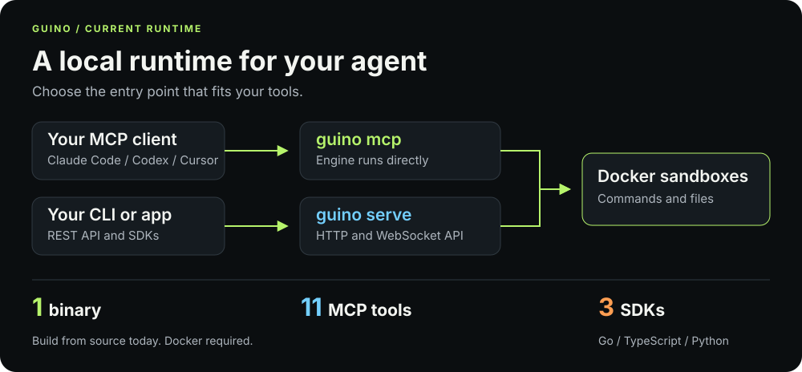
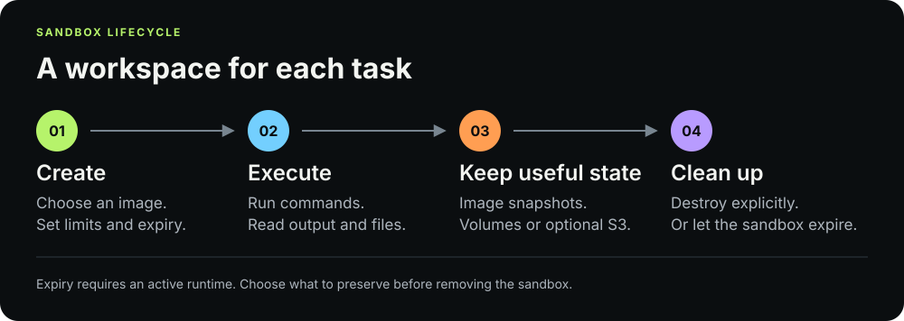

<p align="center">
  
</p>

<h1 align="center">Guino</h1>

<p align="center"><strong>A local home for your AI agents' code.</strong></p>
<p align="center">Docker sandboxes. Your infrastructure. No cloud account required.</p>

<p align="center">
  <a href="#quickstart">Quickstart</a> ·
  <a href="#how-guino-fits">How it works</a> ·
  <a href="#connect-your-agent">Connect your agent</a> ·
  <a href="docs/README.md">Documentation</a> ·
  <a href="CONTRIBUTING.md">Contribute</a> ·
  <a href="README.zh-CN.md">中文</a>
</p>

Guino gives AI agents a place to run commands, work with files and keep useful state in Docker sandboxes. Use it from your terminal, your application or an MCP client. The CLI, REST API, Go/TypeScript/Python SDKs and MCP server share the same sandbox engine.

Everything runs on infrastructure you control. Once the binary and required container images are installed, the local runtime works offline.

**Release status:** build from source today. Guino binaries and npm/PyPI packages are not published yet; `v0.1.0` is planned. Follow the [installation guide](docs/docs/installation.md) to get started.

## How Guino fits

<p align="center">
  <picture>
    <source media="(max-width: 600px)" srcset="docs/assets/readme/runtime-overview-mobile.svg">
  
  </picture>
</p>

Use **MCP** to give your agent direct access to the sandbox engine, or **serve** to connect through the CLI, API and SDKs. Each runtime needs exclusive ownership of its managed Docker resources; the [connection guide](#connect-your-agent) explains how to switch between them.

Configure execution limits and networking on your Docker host, keep useful state with volumes or image snapshots, and see what is running in the embedded dashboard.

## Quickstart

You need **Go 1.25.7+**, **Git** and a running **Docker daemon with Linux container support**. Your user must be able to access Docker. On macOS, Docker Desktop or another local Linux VM provides the container host. Initial dependency and image downloads need internet access.

### 1. Build and start

```bash
git clone https://github.com/tmls-ai/guino.git
cd guino
go build -o bin/guino ./cmd/guino
docker pull ubuntu:24.04

# Bind locally; give sandboxes 1 CPU, 512 MiB and no external networking.
GUINO_SERVER__HOST=127.0.0.1 \
GUINO_RUNTIME__DEFAULT_NETWORK_MODE=none \
GUINO_SANDBOX__DEFAULT_CPU=1000000000 \
GUINO_SANDBOX__DEFAULT_MEMORY=536870912 \
./bin/guino serve
```

The API and dashboard are at **<http://127.0.0.1:8080>**. This setup is for a trusted local machine; API authentication is disabled by default. Existing configuration and environment overrides still apply. Read [configuration](docs/docs/configuration.md) before sharing the server.

### 2. Run something

In another terminal, from the same `guino` checkout:

```bash
sandbox_id=$(./bin/guino create --image ubuntu:24.04 --timeout 300)
./bin/guino exec "$sandbox_id" -- sh -c 'echo Hello from Guino'
./bin/guino ls
./bin/guino rm "$sandbox_id"
```

The execution prints `Hello from Guino`. The sandbox expires after five minutes unless removed earlier. Its root filesystem is read-only by default; use `/tmp` for temporary files or configure a [persistent volume](docs/docs/concepts.md).

For an image with development tools, build the optional [default image](images/default/Dockerfile):

```bash
docker build -t guino/default:latest images/default/
```

Continue with the [full quickstart](docs/docs/quick-start.md) or [installation guide](docs/docs/installation.md).

## A sandbox for each task

<p align="center">
  <picture>
    <source media="(max-width: 600px)" srcset="docs/assets/readme/sandbox-lifecycle-mobile.svg">
  
  </picture>
</p>

Keep temporary work in the sandbox and preserve the results you need. **Image snapshots** save filesystem changes; **volumes** and optional **S3 transfers** handle data you want to keep separately. Snapshots do not capture running processes, tmpfs or mounted-volume contents. See [core concepts](docs/docs/concepts.md) for the storage model.

## Connect your agent

Guino's stdio MCP server gives agents **11 tools** for sandbox lifecycle, command execution, files and snapshots. The client launches `guino mcp`, which runs the engine directly.

```text
Your MCP client  →  guino mcp   →  Docker sandboxes
Your app / CLI   →  guino serve →  Docker sandboxes
```

Start with [MCP setup](docs/docs/mcp.md) to prepare the binary, configuration and dedicated store, then choose your client:

| Client | Setup guide |
|---|---|
| Claude Code | [Connect Claude Code](docs/docs/claude-code.md) |
| Codex | [Connect Codex](docs/docs/codex.md) |
| Cursor | [Connect Cursor](docs/docs/cursor.md) |
| Custom agent or another MCP client | [Generic client configuration](docs/docs/custom-agents.md) |

MCP does not need a running API server. Each runtime process needs exclusive ownership of its database **and managed Docker resources**: stop `serve` before switching that runtime to MCP. A separate database alone does not isolate Docker ownership. The setup guide covers this in detail.

## Build with Guino

The SDKs connect your application to `guino serve`. Use the source installation instructions while package publishing is pending.

| Language | Package or import | Guide |
|---|---|---|
| Go | `github.com/tmls-ai/guino/pkg/client` | [Go SDK](docs/docs/sdks.md#go-sdk) |
| TypeScript | `@tmls-ai/guino` | [TypeScript SDK](sdk/typescript/README.md) |
| Python | `from guino import Guino` | [Python SDK](sdk/python/README.md) |

Prefer HTTP? Use the [REST API reference](docs/api-reference.md). Command execution also supports [WebSocket streaming](docs/api-reference.md), including stdout, stderr and exit status.

| Capability | What is included |
|---|---|
| Lifecycle | Create, list, inspect, stop and destroy sandboxes; automatic expiry |
| Execution and files | Commands, streaming output, file read/write, directory operations and transfers |
| Snapshots | Docker image snapshots and restore; excludes tmpfs and mounted-volume contents |
| Storage | Persistent/shared volumes, configurable tmpfs, optional S3 import/export and hooks, optional FUSE |
| Resource management | CPU, memory and PID limits, host pressure monitoring and throttling |
| Operations | Embedded dashboard, API key authentication, rate limiting and TLS configuration |

## Isolation and security

Guino is designed for local development and self-hosted environments with a trusted operator. Containers share the Docker host's kernel and do not provide a universal security boundary for mutually hostile tenants. Access to the Docker socket grants host-level container control.

By default, sandboxes have a read-only root filesystem, writable tmpfs/explicit mounts, `no-new-privileges` and a PID limit of 256. The runtime drops all Linux capabilities, then adds back `NET_BIND_SERVICE`, `CHOWN`, `SETUID`, `SETGID`, `DAC_OVERRIDE` and `FOWNER`. CPU and memory are **unlimited unless configured**; the quickstart sets both explicitly.

The default `internal` network can still reach the bridge gateway, embedded DNS and host services. The quickstart uses `none`, which disables external networking while retaining container loopback. Bridge mode requires an explicit opt-in and permits unfiltered egress. Networking settings do not eliminate shared-kernel or shared-volume risks.

Read the [security model](SECURITY.md) and [self-hosting guide](docs/docs/self-hosting.md) before exposing the API or running untrusted workloads. Report vulnerabilities using the process in [SECURITY.md](SECURITY.md).

## Learn more and contribute

- [Core concepts](docs/docs/concepts.md) and [architecture](docs/docs/architecture.md)
- [Configuration](docs/docs/configuration.md) and [resource management](docs/docs/resources.md)
- [CLI reference](docs/cli.md), [REST API](docs/api-reference.md) and [MCP tools](docs/docs/mcp.md#available-tools)
- [Development and testing](CONTRIBUTING.md), [roadmap](ROADMAP.md) and [issues](https://github.com/tmls-ai/guino/issues)
- [Complete documentation](docs/README.md)

Contributions are welcome: clear bug reports, reproducible tests, documentation improvements and focused pull requests all help. Start with [CONTRIBUTING.md](CONTRIBUTING.md).

## Maintainers and license

Guino is maintained by [TMLS](https://github.com/tmls-ai), with [gjija](https://github.com/gjija).

The runtime is licensed under **AGPL-3.0**; see [LICENSE](LICENSE). The [TypeScript](sdk/typescript/package.json) and [Python](sdk/python/pyproject.toml) SDK package metadata declares MIT.
